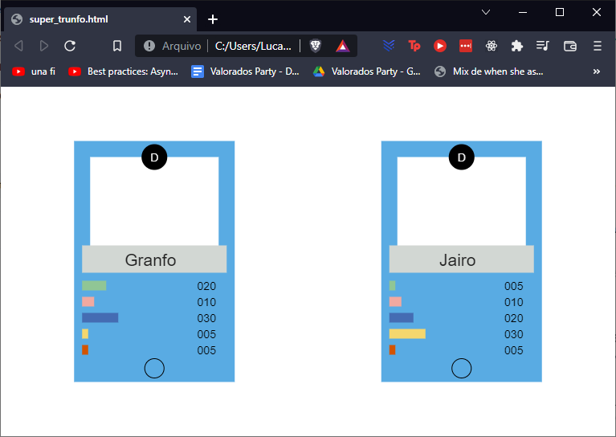

# Super-Trunfo-js

###Description:
Card Game Like Top Trumps write in HTML5 + Javascript using the Canvas and OOP

##Start Date:
1/3/2016

###Last Update:
23/5/2017

###Status:
Paused

###Features:
- **Card**: can now create a card object with properties
- **cardList**: our card "database"
- **getRandomCard**: generates a random card from the cardList
- **Deck**: can now create your deck with name, size, push cards into your deck and draw cards from your deck
- **renderCard**: render your card in the screen using renderCard

###Development:
todo: focus in the player and combat stuff.

###NOTE:
I'm working and studying. Not much time left to play here now :[

That is it. Jesus be with you!

